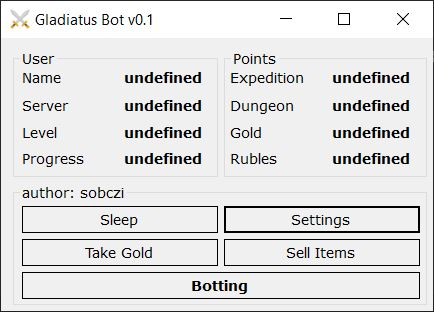
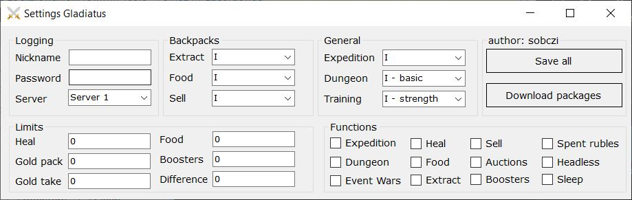

# Automation for Gladiatus Game
Automate farming in Gladiatus! Setup your bot with user-friendly GUI!
## Main

### Displays whole data about player
If player is on location where dungeons are unavaliable it will show 0.
### Sleep
Deactivate on mouse-move detect.
### Take gold 
Starts taking gold from packages.
### Sell Items
Starts selling items from packages.
### Botting 
Determines if program is currently running in normal mode.
### Status of buttons:
* Bold -> active
* Regular -> !active

If take gold or sell items action is pressed default scheme is deactivated untill user will turn it on back again.

## Settings

### Backpacks
Determine where program should search described things.
### General
* Expedition
  * Counting enemies from left
* Dungeon
  * Level of dungeon standard/advenced
  * If advenced dungeon is unavaliable then goes to standard one
* Training 
### Limits
* Heal
  * Percentage
* Gold pack
  * Minimum gold
* Gold take
  * Maximum gold
* Food  
  * Maximum number of pages in packages
* Boosters
  * Maximum number of pages in packages
* Difference 
  * Maximum difference between price and value in auction house
### Functions
* Expeditions
* Dungeons
* Event Wars
* Heal
* Food 
  * Buys new food from auction house
* Extract 
  * Specify custom items for extract in settings/extract.txt (e.g. Lucius - write one name per line)
* Sell 
  * Sells items before exit (w/o scrolls, mercenaries, food, additives and event items)
* Auctions 
  * Buys items from auction house before exit (e.g. rings, amulets, food - hides whole gold)
* Boosters 
  * Buys boosters from auction house before exit (useful in 100+ levels for Hades)
* Sleep 
  * Turns sleep mode if user is AFK (if didn't found any mouse-move during bot session)
* Headless 
  * Runs browser in headless mode
* Pack 
  * Buys packs from guild market - based on settings/packages.txt 
* Training 
  * Trains specified skill before exit
* Costume 
  * Takes hades costume if used all points
* Spent rubles 
  * Determines if bot should use rubles during his work (e.g. loading new shops)
* Colours 
  * Specify which colours bot should extract and sell
  
### Buttons
* Save all
* Download packages (goes to guild market and loads all items to .txt file for pack function)  

## Built with
* C#
* WinForms
* [Selenium Framework](https://github.com/SeleniumHQ/selenium)
* [Gladiatus Crazy Addon](https://github.com/DinoDevs/GladiatusCrazyAddon)

## Authors
* Daniel Sobczak - whole work - student of WI ZUT SZCZECIN, POLAND.

## Future
* Installator,
* Buying items from auction house (rings, amulets, boosters, food),
* Auto-Hades (tried in the past but unssuccesfully, kinda tricky).

## Acknowledgments
* Community of
  * Visual Studio
  * StackOverFlow
  * GitHub
  * Gladiatus Crazy Addon
